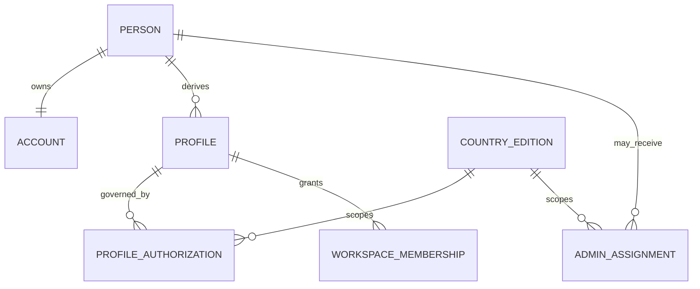
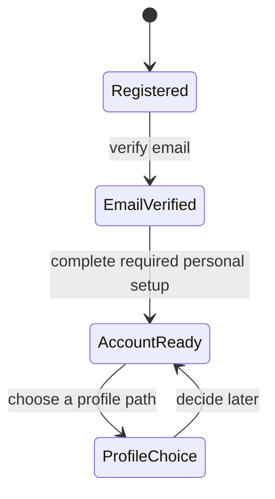
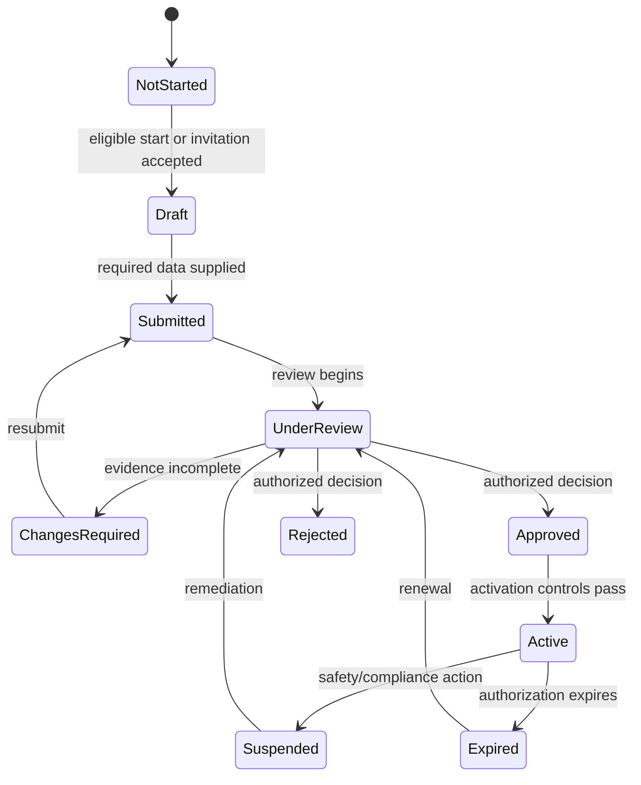

# Reconciled Application Architecture

## 1. Decision and implementation boundary

This document is the target architecture for reconciling the current legacy Merchant application with the person-first Business & Life ecosystem.

The product direction is approved and implementation is in progress. The architecture is **not a statement that every target behavior is already accepted**. Runtime behavior remains governed by the current implementation until each reconciliation phase is merged and verified through the [Philippines Reference Edition Quality and Onboarding Plan](../implementation/PH_REFERENCE_EDITION_QUALITY_AND_ONBOARDING_PLAN.md).

The central rule is:

> One person owns one private account. Public or operational profiles derive from that person. Administration is delegated authority, never a profile that a user may self-activate.

The Philippines edition is the first complete reference edition, not a permanent country-specific
fork. Future country editions reuse the same domain and interaction core. Country law, tax,
currency, language, payment providers, statutory documents, territory hierarchy and evidence rules
are isolated in versioned edition configuration and jurisdiction adapters. A country difference must
never be represented by cloning the application or silently changing shared domain semantics.

## 2. Product model

### 2.1 Separate concepts

| Concept | Meaning | Created how | Visible to whom |
| --- | --- | --- | --- |
| Person | A human identity in the platform | Registration with email/password or federated identity | The person and authorized operators |
| Account | Private home, identity, security, notifications and profile management for one person | Automatically with the person | The signed-in person |
| Profile | A Customer, Merchant, Supplier, Delivery or Local Services operating identity derived from the person | Explicit activation/application/invitation | According to profile visibility and state |
| Workspace | The tools and data belonging to one active profile | Available when profile authorization permits | Profile owner and delegated business members |
| Admin assignment | Time- and scope-limited platform authority granted to a person | Invitation or designation by authorized Admin | Only the assignee and authorized administrators |
| Country edition | Product, policy, currency, locale and operational boundary | Platform configuration | Users permitted in that edition |

The database and UI must not use `role`, `profile`, `workspace` and `admin` as interchangeable words.

### 2.2 Canonical relationships



An Admin assignment points to the person, not to their Customer or Merchant profile. Removing or suspending a public profile does not grant, remove or alter Admin authority.

## 3. Identity and country model

### 3.1 Stable identifiers

New records use opaque, immutable identifiers with no nationality encoded in them:

- internal person key: UUID/ULID;
- display Personal ID: `BL-P-<opaque-checkable-token>`;
- profile display ID: `BL-<profile-code>-<opaque-checkable-token>` with an immutable relation to `person_id`;
- Admin assignment ID: independent from profile IDs.

Existing country-coded IDs such as `BL-PH-P-...` remain permanent aliases. They must never be rewritten or reused. Their `PH` segment is interpreted as the issuing platform edition, not proof of citizenship, nationality or current residence.

Profile IDs are derived relationally from the Personal ID, not by treating the visible Personal ID string as the source of truth. Disabling and reactivating a profile retains its original ID and history.

### 3.2 Country facts must remain separate

| Field | Example | Source | Use |
| --- | --- | --- | --- |
| Registration edition | PH | Platform route/configuration | Terms and onboarding context |
| Nationality claim | RO | Person declaration plus verification when required | Eligibility/compliance only |
| Residence country | IE | Person declaration/evidence when required | Address, tax/compliance context |
| Preferred locale | ro-RO | Person choice | Language and formatting |
| Profile operating market | PH | Profile application and authorization | Marketplace and operational rules |
| Admin scope | PH / territory / function | Admin assignment | Privileged authorization |
| Last sign-in country | PH | Approximate IP security signal | Security notification/risk only |

The avatar/account header may show country flags with explicit labels, for example `Residence: 🇮🇪 Ireland` and `Merchant market: 🇵🇭 Philippines`. A flag without a label is ambiguous and must not be used as identity proof.

IP-derived location:

- must never assign nationality, residence or profile market;
- may suggest a country during onboarding, subject to confirmation;
- may support fraud/security signals and session history;
- must be stored with minimization, retention and access controls;
- must not silently change a person's identifiers or entitlements.

## 4. Canonical application shell

### 4.1 One explicit navigation state

The application must have one router/store state instead of parallel DOM overlays, database role state and local-storage role state:

```text
surface = guest | account | profile | admin
selected_profile_id = null | owned/authorized profile ID
selected_admin_assignment_id = null | active assignment ID
```

The server validates every requested surface. Client state may remember a preference but may never create authority.

### 4.2 Entry rules

| Situation | Initial destination |
| --- | --- |
| New authenticated person | Account Home |
| Returning person with profiles | Account Home |
| Deep link to an authorized profile route | Requested profile route after server validation |
| Deep link to an active Admin route | Requested Admin route after assignment validation |
| Invalid, disabled or unauthorized target | Account Home with a clear explanation |
| Signed-out visitor | Guest/public experience or sign-in gate |

Normal launch never defaults to Merchant merely because a Merchant profile exists or because a legacy `active_role` value remains stored.

### 4.3 Account Home and avatar menu

The avatar opens a compact account switcher, not a long settings form. It contains:

1. person name, avatar and Personal ID;
2. verified country facts with labels;
3. `Account Home`;
4. owned profiles, each with state and profile ID;
5. `Admin Workspace` only when the server returns at least one active Admin assignment;
6. one `Account settings` action;
7. sign out.

New users never see an Admin item. A suspended or expired Admin assignment is not a usable navigation item; its status may appear in a controlled history screen.

## 5. Settings information architecture

Settings are routes/screens, not injected sections in one drawer.

| Surface | Settings card/routes | Ownership |
| --- | --- | --- |
| Account | Personal details; email & sign-in; password/security; sessions; language & accessibility; country/address claims; notifications; privacy/data; profile management | Person |
| Customer | Public/customer identity; addresses; preferences; privacy; profile status | Customer profile |
| Merchant | Business identity; locations; staff/access; payments/accounting preferences; notifications; documents & authorization; profile status | Merchant workspace |
| Supplier | Business identity; catalog/fulfilment; relationships; staff/access; documents & authorization; profile status | Supplier workspace |
| Delivery | Vehicle/mode; availability; territory; location/privacy; documents/insurance; profile status | Delivery profile |
| Local Services | Public presentation; categories; service area; credentials; privacy; profile status | Service Provider profile |
| Admin | Admin preferences; assignment/scope; privileged session security; operational notifications | Admin assignment |

Each active profile workspace has a visible `Settings` card in its own home/dashboard. Account settings remain accessible from Account Home. Profile settings may never change Personal ID, account credentials or Admin authority.

## 6. Profile lifecycle and onboarding

### 6.1 Person-first registration



Registration creates only the person and private account. It does not activate Customer, Merchant, Supplier, Delivery, Local Services or Admin.

### 6.2 Profile state machine

Every profile uses explicit states. No single `enabled=true` flag may represent application, evidence, review and operating authorization.



Customer may compress review steps when platform policy permits, but activation still requires explicit user choice and required account verification.

### 6.3 Activation policy matrix

| Profile | Start path | Evidence/review | Self-activation |
| --- | --- | --- | --- |
| Customer | Person chooses `Create Customer profile` | Account/email checks and applicable consumer requirements | Allowed when checks pass |
| Merchant | Invitation or approved governed entry | Business/application evidence and authorized review | No |
| Supplier | Invitation or approved governed entry | Business/application evidence and authorized review | No |
| Delivery | Invitation/eligibility path for the operating market | Mode-, vehicle-, driver-, insurance- and territory-specific evidence | No |
| Local Services | Open application | Category-specific qualifications/evidence and review | No direct activation |
| Admin | Invitation/designation by authorized Admin | Assignment, scope, functions, security and acceptance | Never |

Country requirements are data-driven and versioned. For the Philippines, a legal or compliance item becomes an executable gate only when the official source, applicability, evidence, effective date, reviewer and exception path are recorded. Unverified assumptions remain research items, not mandatory UI claims.

### 6.4 Profile management actions

The UI action depends on state: `Create`, `Continue onboarding`, `Accept invitation`, `View review`, `Open profile`, `Renew`, `Request reactivation`, or `View status`.

Deactivation rules:

- optional profiles may be voluntarily deactivated when there are no blocking obligations;
- Merchant must not be marked `Required` merely because it is the legacy runtime role;
- deactivation preserves IDs, financial/audit records and legal retention data;
- suspension/revocation is an authorized platform action, distinct from voluntary deactivation;
- a person with no active profiles still retains Account Home.

## 7. Delegated Admin architecture

### 7.1 Assignment model

An Admin assignment contains:

- `person_id`;
- rank (`super_admin`, `country_admin`, `territory_admin`, `specialist`);
- country/territory scope;
- explicit function bundles and permissions;
- status (`invited`, `active`, `suspended`, `revoked`, `expired`);
- inviter/grantor and authorization chain;
- start/end dates;
- acceptance and strong-authentication state;
- reason and immutable audit events.

### 7.2 Grant flow

Only an authorized administrator may:

1. select an existing verified person or invite a verified email;
2. choose rank, scope and function bundles within their own delegable authority;
3. set dates and conditions;
4. require acceptance and stronger authentication;
5. activate the assignment;
6. amend, suspend, revoke or renew it with an audit reason.

The platform rejects self-promotion, grants above the grantor's rank/scope, and permission checks based only on hidden navigation.

### 7.3 Admin UI contract

Admin Workspace is a separate protected shell. Its modules are generated from server-authorized functions. Support, profile review, compliance, trust & safety and territory operations are permissions, not proof that every Admin has all powers.

All privileged mutations require server-side authorization and an audit event. Sensitive actions may require step-up authentication and separation of duties.

## 8. Notifications, support and deep links

Notifications use a typed target contract:

```text
type, recipient_person_id, actor_type, object_type, object_id,
target_surface, target_route, aggregation_key, unread_count, latest_event_at
```

For a support ticket, `aggregation_key = support_ticket:<ticket_id>:<recipient_person_id>`. New replies update the existing notification thread, unread count and timestamp instead of creating unlimited duplicate cards.

Opening a notification resolves the route server-side and takes the user to the exact ticket in the correct surface. It must never fall back to Merchant Accounting because of an old active role.

Support messages record immutable actor identity and display role separately:

- Customer/User message: person/profile presentation;
- Support reply: `Business & Life Support` or authorized agent presentation;
- system event: neutral system presentation.

Color and alignment may reinforce the distinction, but accessible text labels and actor metadata are mandatory. Admin Support retains microphone and AI assistance where authorized; translation requires explicit source/target language and user confirmation before sending.

## 9. Data, storage and security boundaries

### 9.1 Data ownership

- Account data is person-scoped.
- Business data is workspace/profile-scoped.
- Admin data is assignment/function/scope-scoped.
- Country-edition data access is denied by default across editions.
- Financial events retain immutable actor and workspace attribution.

### 9.2 Evidence storage

Uploaded identity, vehicle, insurance, credential and business evidence must move from database-embedded base64 data to private object storage. The database stores metadata, ownership, classification, checksum, retention, review state and an opaque object reference.

Access uses short-lived authorized retrieval, malware/type/size validation, encryption, audit logging and deletion/retention policy. Evidence is never served through a public URL.

### 9.3 Web security baseline

The reconciliation must include:

- secure, HTTP-only, same-site session cookies or an equivalently reviewed token architecture;
- no long-lived bearer token in `localStorage`;
- Content Security Policy and security headers;
- output encoding and removal of unsafe dynamic `innerHTML` paths;
- CSRF protection where cookie authentication applies;
- rate limits for sign-in, recovery, verification, invitations and privileged actions;
- step-up authentication for Admin and sensitive account actions;
- server authorization on every object and mutation;
- structured audit trails with secret/PII redaction.

## 10. Accessibility, mobile and resilience

The canonical shell is mobile-first and must support:

- 320 px-wide layouts without clipped navigation;
- touch targets of at least 44×44 CSS pixels;
- keyboard navigation and visible focus;
- semantic labels, headings, errors and live status;
- contrast-compliant state indicators that do not rely on color alone;
- reduced motion;
- skeleton/loading states that do not expose partially authorized UI;
- timeout, retry and offline-safe error states;
- no help or toast overlay covering the active form action.

Profile and Admin entitlements load before the switcher becomes interactive. A bounded loading state is preferable to showing incorrect profiles and adding Admin a few seconds later.

## 11. API and domain boundaries

Target services may initially live in one deployable application, but their interfaces remain separated:

| Domain | Responsibilities |
| --- | --- |
| Identity | person, authentication identities, verification, sessions |
| Account | personal details, preferences, countries, privacy |
| Profiles | profile records, lifecycle and derived IDs |
| Authorization | profile authorizations, Admin assignments, permission evaluation |
| Onboarding | applications, requirements, evidence and decisions |
| Workspaces | profile-specific operational data and memberships |
| Notifications | typed events, aggregation, unread state and deep links |
| Support | tickets, messages, actor attribution and translation assistance |
| Audit | immutable security, authorization and privileged-action records |

The server returns a single session bootstrap payload containing person summary, account readiness, profile summaries, active Admin assignments and allowed initial routes. Legacy clients must not independently infer these from multiple endpoints.

## 12. Non-negotiable invariants

1. A new account has no activated public profile and no Admin access.
2. Account Home is always available to an authenticated, non-locked person.
3. Admin is visible only with a current server-authorized assignment.
4. No client value can grant profile or Admin authority.
5. Country flags are labeled facts, not identity inference.
6. IP does not determine Personal ID, citizenship, residence or market authorization.
7. Governed profiles cannot bypass invitation/application/review.
8. IDs and audit history survive disablement and reactivation.
9. Profile data and tools never leak into Account Home or another profile workspace.
10. Every notification deep link names and validates its target surface and object.
11. Private evidence is never public or stored as an unrestricted data URL.
12. Legacy Merchant behavior is removed only after equivalent target flows pass acceptance tests.

## 13. Related canonical documents

- [Admin Workspace and Delegation](./ADMIN_WORKSPACE_AND_DELEGATION.md)
- [Guest Exploration and Onboarding](./GUEST_EXPLORATION_AND_ONBOARDING.md)
- [Profile Governance](../implementation/V0.8.6_PROFILE_GOVERNANCE.md)
- [Philippines Authorization Matrix](../compliance/ph/AUTHORIZATION_MATRIX.md)
- [Profile Authorization SOP](../sop/SOP_PROFILE_AUTHORIZATION.md)
- [Reconciliation Implementation Plan](../implementation/RECONCILIATION_IMPLEMENTATION_PLAN.md)
